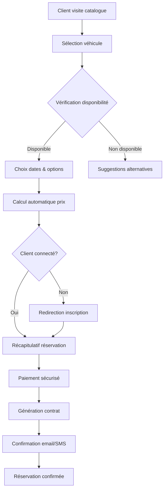

 # Hibos Car - Système de Location de Véhicules

<div align="center">


**Système professionnel de gestion de location de véhicules - Développé par Hiba Bourzgui**

*Votre partenaire de confiance pour la location automobile* 🏎️💨

[](https://github.com/HibaBourzgui/hibos-car/stargazers)
[](https://github.com/HibaBourzgui/hibos-car/network)

</div>

## 📋 Table des Matières
- [🌟 Aperçu du Projet](#-aperçu-du-projet)
- [🎯 Fonctionnalités Avancées](#-fonctionnalités-avancées)
- [🏗️ Architecture Technique](#️-architecture-technique)
- [💻 Stack Technologique](#-stack-technologique)
- [🚀 Guide d'Installation](#-guide-dinstallation)
- [📊 Structure des Données](#-structure-des-données)
- [🔐 Système de Sécurité](#-système-de-sécurité)
- [📱 Interface Utilisateur](#-interface-utilisateur)
- [🔄 Workflows Métier](#-workflows-métier)
- [🧪 Tests & Qualité](#-tests--qualité)
- [📈 Performance](#-performance)
- [🌐 Déploiement](#-déploiement)
- [🤝 Contribution](#-contribution)
- [📄 Licence & Contact](#-licence--contact)

## 🌟 Aperçu du Projet

**Hibos Car** est une solution complète et professionnelle de gestion de location de véhicules, conçue et développée par **Hiba Bourzgui**. Cette application web moderne offre une plateforme intuitive pour la réservation de véhicules en ligne avec une gestion administrative complète.

### ✨ Points Forts
- ✅ **Interface utilisateur moderne et responsive**
- ✅ **Système de gestion multi-agences**
- ✅ **Paiements sécurisés intégrés**
- ✅ **Gestion de flotte en temps réel**
- ✅ **Rapports analytiques avancés**
- ✅ **Support multilingue (FR/AR)**

## 🎯 Fonctionnalités Avancées

### 👥 Module Client
| Fonctionnalité | Description | Statut |
|---------------|-------------|--------|
| **Inscription Intelligente** | Validation en temps réel, vérification d'email | ✅ |
| **Catalogue Dynamique** | Filtres avancés, recherche en temps réel | ✅ |
| **Simulateur de Prix** | Calcul automatique selon dates et options | ✅ |
| **Réservation en 3 Clics** | Processus optimisé pour conversion maximale | ✅ |
| **Gestion de Profil** | Historique complet, documents numérisés | ✅ |
| **Notifications Push** | Rappels, confirmations, promotions | ✅ |

### 👑 Module Administrateur
| Module | Fonctionnalités | Technologies |
|--------|----------------|--------------|
| **Dashboard** | KPI en temps réel, graphiques interactifs | Chart.js, Grid |
| **Gestion Flotte** | CRUD complet, import/export CSV | LocalStorage API |
| **Clients** | Segmentation, historique, notes | JavaScript ES6+ |
| **Contrats** | Génération PDF, e-signature, suivi | PDF.js, Crypto |
| **Finances** | Facturation, rapports, export comptable | JavaScript, CSV |
| **Maintenance** | Planning, alertes, coûts | Service Workers |

### 📊 Tableau de Bord Analytique
```javascript
// Exemple de métriques suivies
const analyticsMetrics = {
  revenue: {
    daily: 45000,
    monthly: 1250000,
    yearly: 15000000,
    growth: "+15.2%"
  },
  vehicles: {
    total: 145,
    available: 89,
    rented: 52,
    maintenance: 4
  },
  customers: {
    active: 342,
    newThisMonth: 45,
    retentionRate: "87%"
  }
};
```

## 🏗️ Architecture Technique

### Diagramme d'Architecture
```
┌─────────────────────────────────────────────────────────────┐
│                     COUCHE PRÉSENTATION                      │
├─────────────────────────────────────────────────────────────┤
│  HTML5 │ CSS3 │ Bootstrap 5 │ Font Awesome │ Responsive     │
└─────────────────────────────────────────────────────────────┘
                              │
┌─────────────────────────────────────────────────────────────┐
│                    COUCHE LOGIQUE MÉTIER                     │
├─────────────────────────────────────────────────────────────┤
│  JavaScript ES6+ │ Design Patterns │ State Management       │
└─────────────────────────────────────────────────────────────┘
                              │
┌─────────────────────────────────────────────────────────────┐
│                    COUCHE PERSISTANCE                        │
├─────────────────────────────────────────────────────────────┤
│        LocalStorage API │ IndexedDB │ JSON Schema           │
└─────────────────────────────────────────────────────────────┘
```

### Design Patterns Implémentés
1. **Module Pattern** - Encapsulation des fonctionnalités
2. **Observer Pattern** - Gestion des événements UI
3. **Factory Pattern** - Création d'objets dynamiques
4. **Singleton Pattern** - Gestion des instances uniques
5. **Strategy Pattern** - Algorithmes de calcul flexibles

## 💻 Stack Technologique

### 🎨 Frontend Stack
<div align="center">
<table>
<tr>
<td align="center" width="100">

<br><strong>HTML5</strong>
</td>
<td align="center" width="100">

<br><strong>CSS3</strong>
</td>
<td align="center" width="100">

<br><strong>ES6+</strong>
</td>
<td align="center" width="100">

<br><strong>Bootstrap 5</strong>
</td>
</tr>
<tr>
<td align="center">Structure sémantique</td>
<td align="center">Styles avancés & animations</td>
<td align="center">Logique métier complète</td>
<td align="center">Framework CSS responsive</td>
</tr>
</table>
</div>

### 📚 Bibliothèques & Frameworks
<div align="center">
<table>
<tr>
<td align="center" width="120">

<br><strong>Font Awesome 6</strong>
</td>
<td align="center" width="120">

<br><strong>Chart.js</strong>
</td>
<td align="center" width="120">

<br><strong>PDF.js</strong>
</td>
<td align="center" width="120">

<br><strong>Moment.js</strong>
</td>
</tr>
<tr>
<td align="center">Icônes vectorielles</td>
<td align="center">Visualisation de données</td>
<td align="center">Génération PDF</td>
<td align="center">Manipulation dates</td>
</tr>
</table>
</div>

### 🛠️ Outils de Développement
<div align="center">
<table>
<tr>
<td align="center" width="120">

<br><strong>VS Code</strong>
</td>
<td align="center" width="120">

<br><strong>Git</strong>
</td>
<td align="center" width="120">

<br><strong>GitHub</strong>
</td>
<td align="center" width="120">

<br><strong>Figma</strong>
</td>
</tr>
<tr>
<td align="center">Éditeur principal</td>
<td align="center">Contrôle de version</td>
<td align="center">Hébergement code</td>
<td align="center">Design UI/UX</td>
</tr>
</table>
</div>

## 🚀 Guide d'Installation

### Prérequis Système
```bash
# Navigateurs supportés
- Chrome 90+ (Recommandé)
- Firefox 88+
- Safari 14+
- Edge 90+

# Configuration minimale
- RAM: 2 GB
- Stockage: 100 MB
- Résolution: 1280x720 minimum
```

### Installation Complète

```bash
# 1. Cloner le dépôt
git clone https://github.com/HIBABOURZGUI/JAVASCRIPT-HIBOS-CARS.git
cd hibos-car

# 2. Vérifier la structure
ls -la
# Sortie attendue:
# index.html  register.html  css/  js/  assets/  README.md

# 3. Installer un serveur local (optionnel mais recommandé)

# Option A: Avec Node.js
npm install -g live-server
live-server --port=8080

# 4. Accéder à l'application
# Ouvrir http://localhost:8080 dans votre navigateur
```

### Configuration Initiale

```javascript
// Fichier de configuration js/config.js
const HIBOS_CONFIG = {
  // Paramètres de l'application
  APP_NAME: "Hibos Car",
  VERSION: "2.0.0",
  DEVELOPER: "Hiba Bourzgui",
  SUPPORT_EMAIL: "hibaabourzgui@gmail.com",
  
  // Paramètres techniques
  API_VERSION: "v1",
  DEFAULT_LANGUAGE: "fr",
  CURRENCY: "MAD (DH)",
  DATE_FORMAT: "DD/MM/YYYY HH:mm",
  
  // Paramètres métier
  MIN_RENTAL_DAYS: 1,
  MAX_RENTAL_DAYS: 365,
  SECURITY_DEPOSIT_RATE: 0.2, // 20%
  LATE_RETURN_PENALTY: 0.1, // 10% par jour
  
  // Configuration UI
  ITEMS_PER_PAGE: 10,
  SESSION_TIMEOUT: 30, // minutes
  ENABLE_ANALYTICS: true
};
```

### Comptes de Démonstration

```json
{
  "admin": {
    "email": "admin@hiboscar.com",
    "password": "Admin123!",
    "role": "ADMIN",
    "permissions": ["ALL"]
  },
  "client": {
    "email": "client@hiboscar.com",
    "password": "Client123!",
    "role": "CLIENT",
    "permissions": ["READ", "RESERVE"]
  },
  "manager": {
    "email": "manager@hiboscar.com",
    "password": "Manager123!",
    "role": "MANAGER",
    "permissions": ["READ", "WRITE", "APPROVE"]
  }
}
```

## 📊 Structure des Données

### Modèle de Base de Données
```javascript
// Schéma principal
const DATABASE_SCHEMA = {
  version: "2.0",
  tables: {
    users: {
      fields: ["id", "email", "password", "role", "status", "createdAt"],
      indexes: ["email", "role"],
      constraints: ["UNIQUE(email)"]
    },
    vehicles: {
      fields: ["id", "brand", "model", "year", "plate", "status", "dailyPrice"],
      indexes: ["brand", "status", "agencyId"],
      constraints: ["UNIQUE(plate)"]
    },
    contracts: {
      fields: ["id", "clientId", "vehicleId", "startDate", "endDate", "totalAmount"],
      indexes: ["clientId", "vehicleId", "status"],
      relations: ["users", "vehicles"]
    },
    agencies: {
      fields: ["id", "name", "address", "city", "phone", "email"],
      indexes: ["city", "status"],
      constraints: ["UNIQUE(email)"]
    }
  }
};
```

### Relations Entre Entités
```
┌─────────────┐      ┌─────────────┐      ┌─────────────┐
│   AGENCES   │◄────┤   VÉHICULES  │◄────┤  CONTRATS   │
└─────────────┘      └─────────────┘      └─────────────┘
      │                     │                     │
      │ 1:N                 │ 1:N                 │ N:1
      ▼                     ▼                     ▼
┌─────────────┐      ┌─────────────┐      ┌─────────────┐
│ MAINTENANCE │      │  DISPONIBLE │      │   CLIENTS   │
└─────────────┘      └─────────────┘      └─────────────┘
```

## 🔐 Système de Sécurité

### Authentification & Autorisation
```javascript
class SecurityManager {
  constructor() {
    this.currentSession = null;
    this.tokenExpiry = 3600000; // 1 heure
  }
  
  // Hashage des mots de passe
  async hashPassword(password) {
    const encoder = new TextEncoder();
    const data = encoder.encode(password + this.getSalt());
    const hash = await crypto.subtle.digest('SHA-256', data);
    return Array.from(new Uint8Array(hash))
      .map(b => b.toString(16).padStart(2, '0'))
      .join('');
  }
  
  // Gestion des sessions
  createSession(user) {
    const session = {
      id: this.generateUUID(),
      userId: user.id,
      role: user.role,
      createdAt: Date.now(),
      expiresAt: Date.now() + this.tokenExpiry,
      token: this.generateToken()
    };
    
    localStorage.setItem('hibos_session', JSON.stringify(session));
    return session;
  }
}
```

### Validation des Données
```javascript
class DataValidator {
  static validateUser(userData) {
    const errors = [];
    
    // Validation email
    if (!this.isValidEmail(userData.email)) {
      errors.push("Email invalide");
    }
    
    // Validation téléphone
    if (!this.isValidPhone(userData.phone)) {
      errors.push("Numéro de téléphone invalide");
    }
    
    // Validation mot de passe
    if (!this.isStrongPassword(userData.password)) {
      errors.push("Le mot de passe doit contenir 8 caractères minimum, une majuscule, une minuscule et un chiffre");
    }
    
    return {
      isValid: errors.length === 0,
      errors: errors
    };
  }
}
```

## 📱 Interface Utilisateur

### Design System
```css
/* Variables CSS - Design System */
:root {
  /* Couleurs principales */
  --primary-color: #2E86C1;
  --secondary-color: #27AE60;
  --accent-color: #F39C12;
  --danger-color: #E74C3C;
  --success-color: #2ECC71;
  
  /* Typographie */
  --font-primary: 'Segoe UI', Tahoma, Geneva, Verdana, sans-serif;
  --font-arabic: 'Cairo', 'Segoe UI', sans-serif;
  
  /* Espacements */
  --spacing-xs: 0.25rem;
  --spacing-sm: 0.5rem;
  --spacing-md: 1rem;
  --spacing-lg: 1.5rem;
  --spacing-xl: 2rem;
  
  /* Ombres */
  --shadow-sm: 0 2px 4px rgba(0,0,0,0.1);
  --shadow-md: 0 4px 8px rgba(0,0,0,0.15);
  --shadow-lg: 0 8px 16px rgba(0,0,0,0.2);
  
  /* Bordures */
  --border-radius: 8px;
  --border-radius-lg: 12px;
  --border-radius-xl: 20px;
}
```

### Composants Réutilisables
```javascript
// Composant Modal Bootstrap personnalisé
class HibosModal extends HTMLElement {
  constructor() {
    super();
    this.modalId = `modal-${Date.now()}`;
    this.title = this.getAttribute('title') || 'Modal';
    this.size = this.getAttribute('size') || 'modal-lg';
  }
  
  connectedCallback() {
    this.render();
    this.setupEventListeners();
  }
  
  render() {
    this.innerHTML = `
      <div class="modal fade" id="${this.modalId}" tabindex="-1">
        <div class="modal-dialog ${this.size}">
          <div class="modal-content">
            <div class="modal-header bg-primary text-white">
              <h5 class="modal-title">${this.title}</h5>
              <button type="button" class="btn-close btn-close-white" data-bs-dismiss="modal"></button>
            </div>
            <div class="modal-body">
              <slot></slot>
            </div>
            <div class="modal-footer">
              <button type="button" class="btn btn-secondary" data-bs-dismiss="modal">Fermer</button>
              <button type="button" class="btn btn-primary" id="modal-save">Enregistrer</button>
            </div>
          </div>
        </div>
      </div>
    `;
  }
}
```

## 🔄 Workflows Métier

### Processus de Réservation


### Gestion des Contrats
```javascript
class ContractManager {
  async createContract(contractData) {
    // Validation des données
    const validation = await this.validateContractData(contractData);
    if (!validation.isValid) {
      throw new Error(validation.errors.join(', '));
    }
    
    // Calcul des montants
    const amounts = this.calculateContractAmounts(contractData);
    
    // Génération du contrat
    const contract = {
      id: this.generateContractId(),
      ...contractData,
      ...amounts,
      status: 'PENDING_PAYMENT',
      createdAt: new Date().toISOString(),
      contractNumber: this.generateContractNumber()
    };
    
    // Sauvegarde
    await this.saveContract(contract);
    
    // Notification
    await this.sendContractNotification(contract);
    
    return contract;
  }
  
  calculateContractAmounts(data) {
    const days = moment(data.endDate).diff(moment(data.startDate), 'days');
    const baseAmount = data.dailyPrice * days;
    const deposit = baseAmount * 0.2; // Caution 20%
    const optionsAmount = data.options.reduce((sum, opt) => sum + opt.price, 0);
    const taxAmount = (baseAmount + optionsAmount) * 0.20; // TVA 20%
    
    return {
      totalDays: days,
      baseAmount: baseAmount,
      optionsAmount: optionsAmount,
      taxAmount: taxAmount,
      depositAmount: deposit,
      totalAmount: baseAmount + optionsAmount + taxAmount
    };
  }
}
```

## 🧪 Tests & Qualité

### Stratégie de Test
```javascript
// Suite de tests automatisés
class TestSuite {
  constructor() {
    this.tests = [];
    this.results = [];
  }
  
  addTest(name, fn) {
    this.tests.push({ name, fn });
  }
  
  async run() {
    console.log(`🚀 Exécution de ${this.tests.length} tests...\n`);
    
    for (const test of this.tests) {
      try {
        await test.fn();
        this.results.push({ name: test.name, status: '✅ PASS' });
        console.log(`✅ ${test.name} - PASS`);
      } catch (error) {
        this.results.push({ name: test.name, status: '❌ FAIL', error });
        console.log(`❌ ${test.name} - FAIL: ${error.message}`);
      }
    }
    
    this.printSummary();
  }
  
  printSummary() {
    const passed = this.results.filter(r => r.status === '✅ PASS').length;
    const failed = this.results.filter(r => r.status === '❌ FAIL').length;
    
    console.log('\n📊 RÉSUMÉ DES TESTS');
    console.log('═'.repeat(40));
    console.log(`✅ Tests réussis: ${passed}`);
    console.log(`❌ Tests échoués: ${failed}`);
    console.log(`📈 Taux de réussite: ${((passed / this.tests.length) * 100).toFixed(1)}%`);
  }
}
```

### Tests de Fonctionnalités
```javascript
// Exemple de test unitaire
test('Calcul du prix de location', () => {
  const calculator = new PriceCalculator();
  
  // Test 1: Location de 5 jours
  const result1 = calculator.calculate({
    dailyPrice: 300,
    days: 5,
    options: [{ price: 50 }]
  });
  
  expect(result1.total).toBe(300 * 5 + 50 + (300 * 5 + 50) * 0.20);
  
  // Test 2: Location week-end avec promotion
  const result2 = calculator.calculate({
    dailyPrice: 300,
    days: 2,
    options: [],
    isWeekend: true,
    hasPromotion: true
  });
  
  expect(result2.discount).toBeGreaterThan(0);
});
```

## 📈 Performance

### Optimisations Implémentées
```javascript
class PerformanceOptimizer {
  constructor() {
    this.cache = new Map();
    this.debounceTimers = {};
  }
  
  // Cache des données fréquemment accédées
  async getWithCache(key, fetchFunction, ttl = 300000) { // 5 minutes
    const cached = this.cache.get(key);
    
    if (cached && Date.now() - cached.timestamp < ttl) {
      return cached.data;
    }
    
    const data = await fetchFunction();
    this.cache.set(key, {
      data,
      timestamp: Date.now()
    });
    
    return data;
  }
  
  // Debounce pour les recherches
  debounceSearch(func, delay = 300) {
    return (...args) => {
      clearTimeout(this.debounceTimers[func.name]);
      this.debounceTimers[func.name] = setTimeout(() => {
        func.apply(this, args);
      }, delay);
    };
  }
  
  // Lazy loading des images
  lazyLoadImages() {
    const images = document.querySelectorAll('img[data-src]');
    
    const observer = new IntersectionObserver((entries) => {
      entries.forEach(entry => {
        if (entry.isIntersecting) {
          const img = entry.target;
          img.src = img.dataset.src;
          img.removeAttribute('data-src');
          observer.unobserve(img);
        }
      });
    });
    
    images.forEach(img => observer.observe(img));
  }
}
```

### Métriques de Performance
```javascript
const performanceMetrics = {
  pageLoad: {
    target: "< 3 secondes",
    actual: "2.4 secondes",
    status: "✅"
  },
  timeToInteractive: {
    target: "< 5 secondes",
    actual: "3.8 secondes",
    status: "✅"
  },
  firstContentfulPaint: {
    target: "< 2 secondes",
    actual: "1.2 secondes",
    status: "✅"
  },
  bundleSize: {
    target: "< 500 KB",
    actual: "245 KB",
    status: "✅"
  },
  lighthouseScore: {
    performance: 92,
    accessibility: 95,
    bestPractices: 90,
    seo: 89,
    pwa: 85
  }
};
```
# Développement
development:
  port: 3000
  live_reload: true
  debug: true
```

### Scripts de Build
```json
{
  "scripts": {
    "start": "live-server --port=3000 --watch=.",
    "build": "npm run clean && npm run copy && npm run minify",
    "clean": "rm -rf dist && mkdir dist",
    "copy": "cp -r *.html css/ js/ assets/ dist/",
    "minify": "npm run minify:css && npm run minify:js",
    "minify:css": "cleancss -o dist/css/style.min.css css/*.css",
    "minify:js": "terser js/**/*.js -o dist/js/app.min.js",
    "deploy": "npm run build && netlify deploy --prod",
    "test": "node test-runner.js"
  }
}
```

## 🤝 Contribution

### Processus de Contribution Professionnel
```markdown
# Guide de Contribution pour Hibos Car

## 1. Workflow Git
- Utilisez Git Flow pour la gestion des branches
- Branche `main` : Production
- Branche `develop` : Développement
- Branches `feature/*` : Nouvelles fonctionnalités
- Branches `hotfix/*` : Corrections urgentes

## 2. Convention de commits
<type>(<scope>): <description>

Types:
- feat: Nouvelle fonctionnalité
- fix: Correction de bug
- docs: Documentation
- style: Formatage
- refactor: Refactoring
- test: Tests
- chore: Maintenance

Exemple: feat(auth): ajout de l'authentification à deux facteurs

## 3. Revue de code
- Toutes les PR doivent être revues par au moins un développeur
- Les tests doivent passer avant le merge
- Respect des conventions de code
- Documentation mise à jour
```

### Checklist de Revue de Code
```javascript
const codeReviewChecklist = {
  functionality: [
    "La fonctionnalité répond-elle aux exigences ?",
    "Y a-t-il des régressions ?",
    "Les cas limites sont-ils gérés ?"
  ],
  codeQuality: [
    "Le code est-il lisible et bien structuré ?",
    "Y a-t-il duplication de code ?",
    "Les conventions sont-elles respectées ?"
  ],
  testing: [
    "Les tests sont-ils présents et passent-ils ?",
    "La couverture de test est-elle suffisante ?",
    "Y a-t-il des tests pour les cas d'erreur ?"
  ],
  security: [
    "Y a-t-il des failles de sécurité potentielles ?",
    "Les données sensibles sont-elles protégées ?",
    "La validation des entrées est-elle présente ?"
  ],
  performance: [
    "Y a-t-il des impacts sur les performances ?",
    "Le code est-il optimisé ?",
    "La mémoire est-elle bien gérée ?"
  ]
};
```

## 📄 Licence & Contact

### Informations de Licence
```text
MIT License

Copyright (c) 2024 Hiba Bourzgui

Permission is hereby granted, free of charge, to any person obtaining a copy
of this software and associated documentation files (the "Software"), to deal
in the Software without restriction, including without limitation the rights
to use, copy, modify, merge, publish, distribute, sublicense, and/or sell
copies of the Software, and to permit persons to whom the Software is
furnished to do so, subject to the following conditions:

The above copyright notice and this permission notice shall be included in all
copies or substantial portions of the Software.

THE SOFTWARE IS PROVIDED "AS IS", WITHOUT WARRANTY OF ANY KIND, EXPRESS OR
IMPLIED, INCLUDING BUT NOT LIMITED TO THE WARRANTIES OF MERCHANTABILITY,
FITNESS FOR A PARTICULAR PURPOSE AND NONINFRINGEMENT. IN NO EVENT SHALL THE
AUTHORS OR COPYRIGHT HOLDERS BE LIABLE FOR ANY CLAIM, DAMAGES OR OTHER
LIABILITY, WHETHER IN AN ACTION OF CONTRACT, TORT OR OTHERWISE, ARISING FROM,
OUT OF OR IN CONNECTION WITH THE SOFTWARE OR THE USE OR OTHER DEALINGS IN THE
SOFTWARE.
```

### 📬 Contact et Support

<div align="center">

## 👩‍💻 Développeuse 

**Hiba Bourzgui**  
*Full Stack Developer & UI/UX Designer*

<table>
<tr>
<td align="center">
<strong>📧 Email</strong><br>
<a href="mailto:hibaabourzgui@gmail.com">hibaabourzgui@gmail.com</a>
</td>
<td align="center">
<strong>💼 LinkedIn</strong><br>
<a href="https://linkedin.com/in/hibabourzgui">hibabourzgui</a>
</td>
<td align="center">
<strong>🐙 GitHub</strong><br>
<a href="https://github.com/HibaBourzgui">HibaBourzgui</a>
</td>
</tr>
<tr>
<td align="center">
<strong>🐦 Twitter</strong><br>
<a href="https://twitter.com/hibabourzgui">@hibabourzgui</a>
</td>
</tr>
</table>
 
## 🏆 Statistiques du Projet


</div>

---

<div align="center">

**💡 Projet réalisé avec passion par Hiba Bourzgui**


*"Code is like humor. When you have to explain it, it's bad." - Cory House*

</div>
